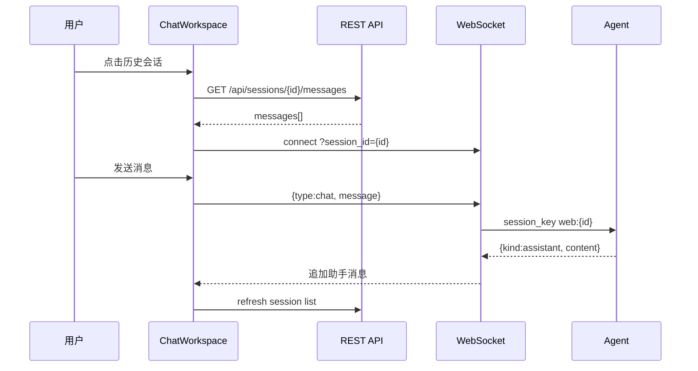

# EthanAgent Web 功能文档

本文档描述 `EthanAgent/web` 前端（Vite + React + JavaScript）。旧目录 `EthanAgent/frontend` 已由 `web` 替代，不再维护。

## 启动方式

```bash
# 终端 1：后端 API
cd EthanAgent
uvicorn api.app:app --reload --host 127.0.0.1 --port 8000

# 终端 2：Web 前端
cd EthanAgent/web
npm install
npm run dev
```

浏览器打开：`http://localhost:5173`  
Vite 将 `/api`、`/ws` 代理到 `127.0.0.1:8000`。

生产构建：

```bash
cd EthanAgent/web
npm run build
npm run preview
```

---

## 界面结构

```
┌─────────────┬──────────────────────────────┬─────────────────┐
│  左侧导航    │         主内容区              │  会话列表（聊天）  │
│  (Sidebar)  │  聊天 / 概览 / 频道 / …       │  (SessionRail)  │
└─────────────┴──────────────────────────────┴─────────────────┘
```

### 左侧导航（与原 frontend 一致）

| 菜单 | 功能 |
|------|------|
| 聊天 | 主对话界面 |
| 概览 | Agent 状态占位 |
| 频道 | Web / 微信 / 企微 等通道说明 |
| 会话 | 会话管理占位表 |
| 定时任务 | Cron 占位 |
| 技能 | Skills 占位 |
| MCP | MCP 服务占位 |
| 配置 | 模型与环境变量说明 |

### 聊天页

1. **新对话**：调用 `POST /api/sessions`，获得 `session_id`，清空消息区并建立 WebSocket。
2. **选择历史会话**：右侧点击某条 → 设为当前 `session_id` → `GET .../messages` 加载历史 → 同一 WebSocket 继续发送。
3. **发送消息**：Enter 发送，Shift+Enter 换行；需 WS 已连接。
4. **消息展示**：Markdown 渲染；用户/助手/系统分色气泡。

**不再使用「只读历史预览」模式**：选中会话即当前会话，底部输入框始终可用（已选会话且 WS 连接时）。

### 右侧会话列表

- 展示 `GET /api/sessions` 返回的会话
- 高亮当前 `session_id`
- 刷新按钮重新拉列表
- 显示通道标签（Web/CLI/Cron）、相对时间、消息条数

---

## 目录结构

```
web/
├── index.html
├── package.json
├── vite.config.js
└── src/
    ├── main.jsx
    ├── App.jsx
    ├── lib/
    │   ├── api.js          # 统一 HTTP/WS
    │   └── format.js       # 时间、key 展示
    ├── hooks/
    │   ├── useSessions.js
    │   └── useWebSocket.js
    ├── components/
    │   ├── Sidebar.jsx
    │   ├── panels/Panels.jsx
    │   └── chat/
    │       ├── ChatWorkspace.jsx
    │       ├── MessageList.jsx
    │       ├── MessageBubble.jsx
    │       ├── Composer.jsx
    │       └── SessionSidebar.jsx
    └── styles/
        ├── global.css
        └── app.css
```

---

## 数据流（继续聊天）



---

## 样式与体验

- 深色主题 + 紫色强调，与 EthanAgent 品牌一致
- 聊天区固定视口高度，消息列表内部滚动
- 新消息自动滚到底部
- 窄屏下会话列表移至聊天区下方

---

## 与后端协作说明

- Web 会话 **必须** 使用 `web:{session_id}` 作为存储 key（见 `bus/events.py`）。
- 若 `.sessions` 下同时存在 `web_xxx.jsonl` 与 `xxx.jsonl`，多为旧版 key 不一致导致；可删除空文件，保留有消息的文件，或合并后只保留 `web_` 前缀文件。
- 接口细节见 [api.md](./api.md)。
